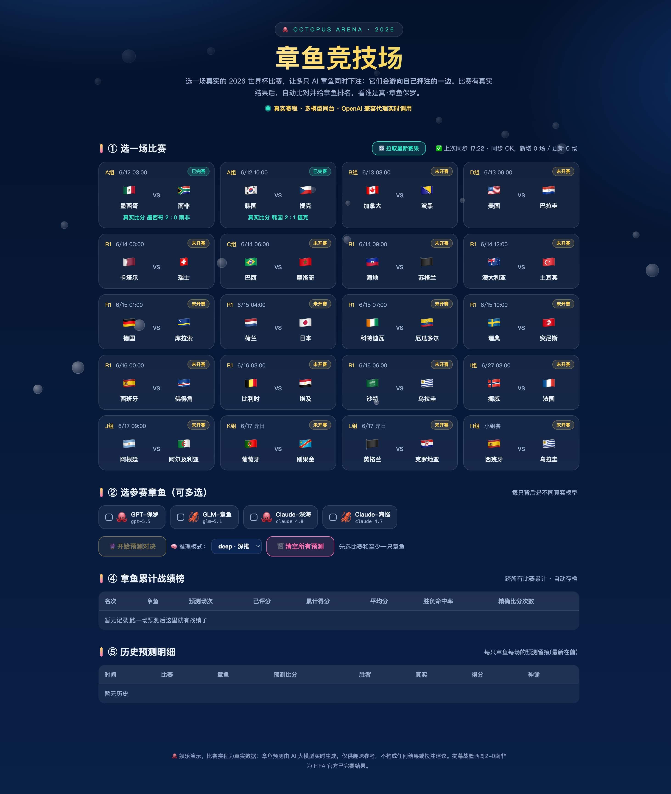

# 🐙 章鱼竞技场 · 2026 世界杯 AI 预测对决

一个本地 Node.js 小项目：4 只「章鱼」（背后是 4 个真实大模型）同时预测 2026 世界杯比赛，
比赛真实结束后自动从 TheSportsDB 拉取赛果并打分排名。



## 项目结构

```
octopus-paul/
├── server.js       # Node 后端 (HTTP server + 代理调用 + 评分持久化)
├── index.html      # 单页前端 (深海风格 UI, 选比赛 → 选章鱼 → 看对决)
├── history.json    # 预测历史 (运行后自动生成, 初始为 [])
└── README.md       # 本文件
```

## 依赖

- **Node.js ≥ 18**（只用 `http` / `https` / `fs` / `path`，无 npm 依赖）
- **后端 LLM 代理**：本项目通过 OpenAI 兼容接口调用大模型，默认指向 `http://127.0.0.1:8066/v1/chat/completions`
  - 可指向任意 OpenAI 兼容服务（自建网关、Ollama、vLLM、openai-proxy 等）
  - 通过 `PROXY_BASE` 环境变量覆盖
- 默认调用的模型名：`gpt-5.5` / `glm-5.1` / `claude 4.7` / `claude 4.8`，请按你的实际模型名修改 `server.js` 顶部的 `OCTOPI` 表

## 启动

```bash
cd octopus-paul
npm start
# 或直接 node server.js
# 自定义端口 / 代理
PORT=8099 PROXY_BASE=http://127.0.0.1:8066 PROXY_MODE=deep node server.js
```

打开浏览器访问 `http://localhost:8099/` 即可。

## 环境变量

| 变量 | 默认值 | 说明 |
|---|---|---|
| `PORT` | `8099` | HTTP 服务端口 |
| `PROXY_BASE` | `http://127.0.0.1:8066` | OpenAI 兼容代理地址 |
| `PROXY_MODE` | `deep` | 默认推理模式 (`fast` / `deep` / `max`)，前端下拉可临时覆盖 |

## 功能一览

- ① 选一场比赛（自动从 TheSportsDB 拉取 2026 世界杯赛程，10 分钟自动同步一次赛果）
- ② 选要出战的章鱼（4 选 N）
- 🧠 选推理模式（`fast` 快答 / `deep` 深推 / `max` 顶配）
- 🔮 一键开始预测对决：所有章鱼并发跑，前端把它们当鱼游进对应区域
- ③ 本场对决榜 + ④ 累计战绩榜 + ⑤ 历史预测明细
- 🗑 一键清空所有历史预测
- 点击战绩榜某只章鱼 → 弹窗看它的全部预测明细

## 评分规则（满分 100）

| 维度 | 分值 |
|---|---|
| 胜负方向命中 | +50 |
| 比分精确命中 | +40 |
| 净胜球差命中 | +10 |

比赛真实结果由 TheSportsDB 异步同步，结果到位后会自动回算所有相关历史预测。

## REST API

| 方法 | 路径 | 用途 |
|---|---|---|
| GET  | `/api/octopi` | 章鱼列表 |
| GET  | `/api/matches` | 赛程 + 同步状态 |
| POST | `/api/arena` | `{matchId, octos:[ids], mode}` 触发预测对决 |
| GET  | `/api/history?octoId=&matchId=` | 历史预测 |
| GET  | `/api/stats` | 累计战绩榜 |
| GET  | `/api/refresh` | 手动同步 TheSportsDB |
| POST | `/api/clear_history` | 清空所有预测 |

## 免责声明

🐙 娱乐演示。比赛赛程为真实数据；章鱼预测由 AI 大模型实时生成，仅供趣味参考，不构成任何结果或投注建议。

## License

[MIT](./LICENSE) © octopus-paul contributors
